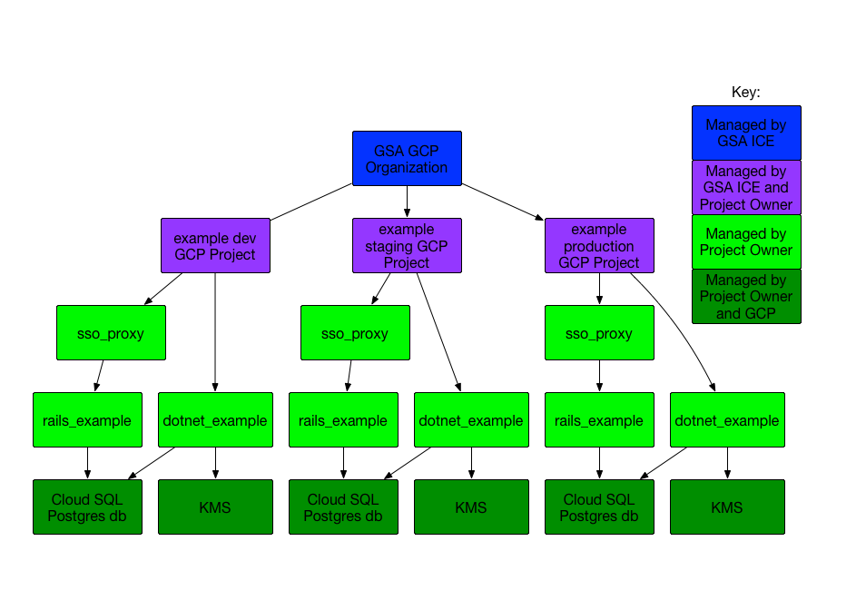

# GCP Provisioning Notes

For GSA ICE folks who are provisioning the GCP Projects for this system,
the overall architecture is:

More details on the template can be found [here](DEVSECOPS.md) as well.

## GCP Project Provisioning

You will need to create three different GCP projects:
* dev
* staging
* prod

It is recommended that you name them something with "dev/staging/prod" in the
names, to help the users know which project they are operating on, but
it is not a requirement.

Once provisioned, you should request that their "In-use IP addresses" quota
be upped to 15 in the us-west region.  You can find this on the
[GCP Quota Page](https://console.cloud.google.com/iam-admin/quotas).
If asked for details, you can say that you have 4 services which may have
up to 3 versions running at once (like during a deploy), requiring at
least 12.  Adding 3 more gives us a bit of breathing room in just in case.
When you provision the Production GCP Project, double this, because you
will be deploying failover instances, thus you'll need at least 2x the IPs.

## Google Groups

It is also recommended that you create google groups for the different types
of users, so that it is easy to enable users for different roles.  The list
of user types are currently:
* Project Owners
* Project Administrators
* Developers with Read/Write access
* Developers with Readonly access

The google group names can be used later on for IAM role provisioning.

## GCP Project Setup

Once everything is set up, you can use the `gcp-appengine-template/gcp_setup/ice_enable_everything.sh`
script to add the service accounts and IAM roles and everything required
for normal operation in each GCP Project.

You can look at the scripts to see what they do, but the main thing that they do
is enable the services that they need to deploy and use App Engine, Cloud SQL,
Cloud KMS, Cloud Storage, and the related build/deploy resources, create the
terraform service account, and then add various IAM roles to the different
groups so that the group members will be able to look at logs, restart things,
etc.

### Windows Platform Usage

Windows machines cannot run the shell scripts, but you should be able to install
[Docker Desktop](https://www.docker.com/products/docker-desktop), which can run
a Linux container on your local system which you can use to do all this.

1. [Install Docker Desktop](https://docs.docker.com/docker-for-windows/install/).  
   You may need to reboot your machine as a part of this.
1. Pull up powershell or whatever command shell you use, and type 
   `docker pull google/cloud-sdk`.
   This should pull down the google cloud SDK images for you to use.
1. `docker run -it google/cloud-sdk`  This should launch the cloud-sdk
   container and give you a shell prompt.
1. Since the cloud-sdk docker image does not have an editor in it, you will
   need to
   1. edit the config file locally using your favorite editor
   1. paste the contents of the file into your terminal window after typing
      `cat > /yourconfigfile.cfg`
   1. hit a `^D` (Control-D) to stop creating the file.  You should get a
      normal shell prompt back.
   1. check that your file is proper by saying `cat yourconfigfile.cfg`
      and verifying the contents.
1. Follow the [Non-windows Platform Usage directions](#non-windows-platform-usage),
   Though you don't need to install the Google Cloud SDK, because that is already
   there.

### Non-windows Platform Usage

To use the `ice_enable_everything.sh` script on a Linux or OS X system, you will need to:
1. Install the [Google Cloud SDK](https://cloud.google.com/sdk/) on your system.
   You can test whether it is installed by saying `gcloud version` and seeing if it
   shows you version info, or an error.
1. `gcloud auth login` to authenticate with GCP
1. `git clone https://github.com/18F/gcp-appengine-template` to clone the repo with the script in it.
1. `cd gcp-appengine-template/gcp_setup` to get into the proper directory
1. Create or copy in a config file for the script.  An example config file can be found in
   `gcp-appengine-template/gcp_setup/ice_enable_everything.cfg.example`.  You will need to
   change all `XXX` instances into something real.
1. `./ice_enable_everything.sh /yourconfigfile.cfg` to run the script (adjust
   the path to yourconfigfile.cfg to where you created it).  You may have to say `Y`
   a couple of times.
1. For bootstrapping, you will need to add the `roles/owner` role to the terraform service account
   temporarily.  Once the environment has been bootstrapped with terraform, you can remove this
   role from the terraform service account.  Coordinate with the Project Owner on this.

## Followup

After the Project Owner has gotten their infrastructure bootstrapped, you should be
able to remove the `roles/owner` role from the terraform service account.

It is also possible that the Project Owner may request more people to be added
as developers or admins over time.  They may also need their quotas adjusted
over time as they deploy more apps or have higher usage.

Other than that, the users of this project template should be in operation after
this!
