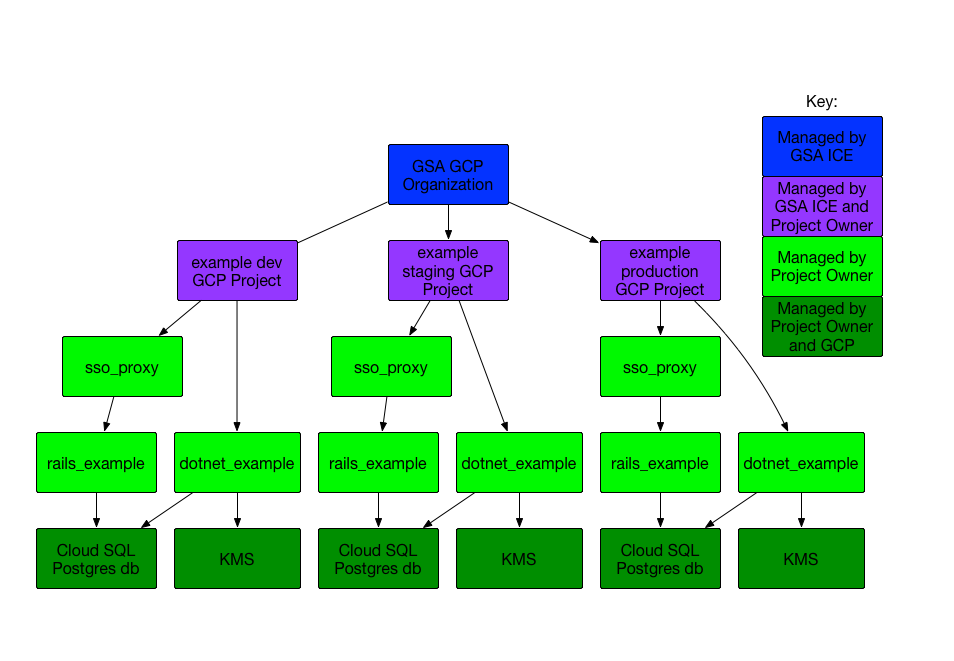

# GCP App Engine template
This repository contains a couple of example applications and
supporting infrastructure and configuration files for Google App Engine.
It is meant to be used by people in the GSA (and other agencies)
as a guide to quickly get a lightweight application running
safely and securely in GCP.

We hope to have procurement information and this process approved by
GSA IT Security to make it so that it will be easy to get
up and running and get an ATO.  

## How to use this template

This template is meant to be forked and edited.  Probably most of this
documentation will be gone, replaced by documentation of your application,
it's technology, and your processes and procedures.

* If you would like to understand the architecture of the project and how it
  fulfils the DevSecOps principles, you should start here and read our
  [DevSecOps documentation](DEVSECOPS.md).
* If you would like to test out how to get GCP going with some example apps,
  then follow the [Bootstrap Process](Bootstrap.md).  This is a good place to
  start just to get your feet wet with GCP and take the example apps for a
  test drive.
* If you would like to begin customizing this template for your application,
  then you should consult the [Customization document](Customize.md).
* Compliance documentation and information about how to get a GSA LATO using
  apps launched with this template can be
  found in [Compliance.md](Compliance.md).
* Operational procedures and workflows can be found in the 
  [Workflows documentation](Workflows.md).  This is an overview of how you
  should do development using a modified gitops system, how to find logs,
  update the infrastructure, rotate secrets, etc.

## Technologies used

### Gitops/Infrastructure As Code

This is less a technology, and more of a way of managing a system only using
code.  The idea is that aside from perhaps some one-off startup tasks, almost
everything is managed by checking in code and moving it between branches.
This ensures that all changes to the system are contained in git, and thus
may be rolled back or reconstructed in a Disaster Recovery scenario.

### Google App Engine
App Engine is a simple way to deploy applications that will automatically scale
up and down according to load, collect logs, etc.  https://cloud.google.com/appengine/

### Google Cloud SQL
Cloud SQL is an easy way to provision and manage databases.  We are using PostgreSQL
for our infrastructure, but you can use MySQL if you like.  Our configuration sets the
production database to be HA, with staging/dev non-HA.

### Terraform
Terraform orchestrates the project setup, creating databases, storage,
secrets, etc.  https://www.terraform.io/

### Circle CI
Terraform and the Google Cloud SDK are invoked on commit by Circle CI, which
automates all of the terraform, code deployment, testing and scanning tasks
for each environment.  https://circleci.com/

### OWASP ZAP
ZAP is a proxy that can be used to scan an app for common security vulnerabilities.
https://www.owasp.org/index.php/OWASP_Zed_Attack_Proxy_Project

## Example Applications

### Rails / App Engine
This is a simple app that uses ActiveRecord to store a "blog" in a db.
It is deployed to GCP with an [OAuth2 Proxy](https://github.com/pusher/oauth2_proxy)
in front of it, so to use it properly, you will need an Identity Provider
to configure it with like login.gov.

To test locally, have ruby/bundler installed and 
run `cd rails-example && bundle install && bin/rails server`.  You will be able
to access the application on http://localhost:3000/.

### .NET Core / App Engine
This is a simple app that creates a list of URLs for "blogs" in a database.  
This may change, but for now, you must use the netcoreapp2.1
framework for applications deployed into App Engine.  It uses KMS to store
antiforgery keys, and has basic auth enabled.

To test locally, `cd dotnet-example && dotnet run`.
This will operate on a local `blogging.db` sqlite db.
