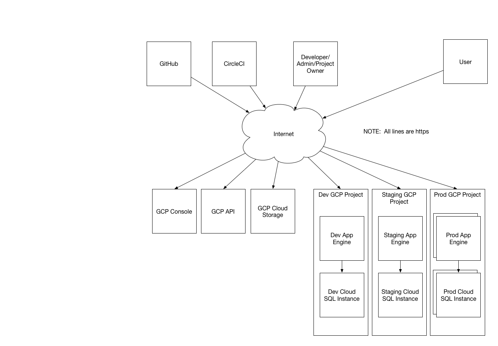
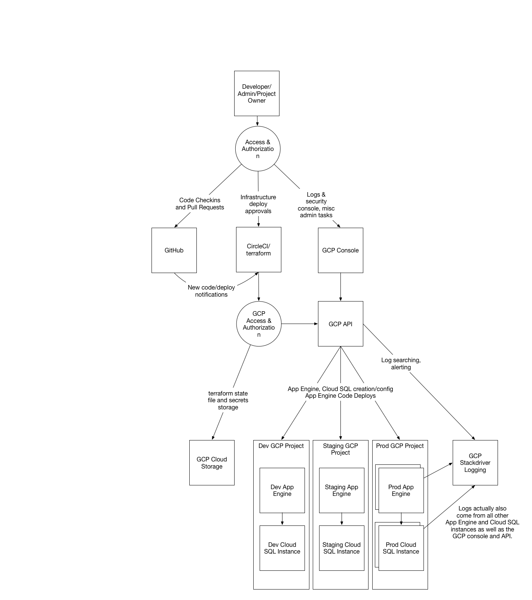

# Welcome!

This document is meant to collect most of the data that you will need to complete a
GSA LATO package.  Since the documents that you must fill out are all Word documents,
and the requirements may change over time, we believe that it would be more useful
for us to collect the data that you need to fill out the package in a useful way
and let you consult it as you fill the actual templates out.

# GSA LATO SSP Template

As you fill out sections in the GSA LATO SSP Template, you should be able to search for
the section name to receive guidance on how to fill it out.

Not all sections have comments.  Those sections should be relatively
self-explanatory.

## Information System Categorization

You will need to decide for yourself whether your information system and it's data
are classified as Low/Moderate/High sensitivity.  The SSP Template has some guidance
on what documents you can consult for understanding these definitions.  As of this
writing, they are [NIST-800-60 Volume 1](https://csrc.nist.gov/publications/detail/sp/800-60/vol-1-rev-1/final)
and [NIST-800-60 Volume 2](https://csrc.nist.gov/publications/detail/sp/800-60/vol-2-rev-1/final).

The Security Objective Impacts section can be filled out once you consult
[FIPS 199](https://nvlpubs.nist.gov/nistpubs/FIPS/NIST.FIPS.199.pdf)

## E-Authentication Determination

If you use authentication in your app, you will need to look over
[NIST-800-63-2](https://nvlpubs.nist.gov/nistpubs/specialpublications/nist.sp.800-63-2.pdf)
for information on how to fill this section out.

## Information System Owner, Authorizing Official, Other Designated Contacts, Assignment of Security Responsibility

Some good documentation on how to understand the roles can be found in the
[18F ATO documentation](https://before-you-ship.18f.gov/ato/).

## Leveraged Provisional Authorizations

The template does not have a pre-built section here for GCP, but you ought to be able
to fill in the information about the 
[GCP Fedramp Package](https://marketplace.fedramp.gov/#/product/google-services-google-cloud-platform-products-and-underlying-infrastructure?sort=productName&productNameSearch=google)
here.

## General System Description
### Information System Components and Boundaries

You should use content from the
[DevSecOps Architecture Document](https://github.com/18F/gcp-appengine-template/blob/master/DEVSECOPS.md) here.
You will need to remove any example app specific text and add text that describes your application instead, and
maybe create your own diagrams.

### Types of Users

Here are the roles that the template uses:

| Role               | Internal or External | Sensitivity/Background | Priv/Nonpriv Functions | MFA             |
|--------------------|----------------------|------------------------|------------------------|-----------------|
| Users              | ???                  | ???                    | ???                    | ???             |
| Developers         | Internal             | ???                    | Edit rights to code, approval for deploys up to staging, read-only access to production GCP Project, editor access to non-prod GCP Projects. | Yes, GitHub 2fa |
| Admins             | Internal             | ???                    | Edit rights to code, approval for all deploys and infrastructure changes, Editor access to GCP Projects. | Yes, GitHub 2fa and Google FIDO 2-step |
| Project Owners     | Internal             | ???                    | Edit rights to code, approval for all deploys and infrastructure changes, Project Owner access to GCP Projects. | Yes, GitHub 2fa and Google FIDO 2-step |
| GSA GCP Org Admins | Internal             | ???                    | Creation/deletion of GCP Projects and GCP User accounts, Project Owner access to GCP Projects | Yes, Google FIDO 2-step |

You will need to fill in the Users row depending on what your application does.
If you have more roles required to manage your application, you will need to add them too.

### Network Architecture

The actual physical network architecture is something which you could probably extract from the
[GCP Fedramp Package](https://marketplace.fedramp.gov/#/product/google-services-google-cloud-platform-products-and-underlying-infrastructure?sort=productName&productNameSearch=google),
or you might be able to use this logical network diagram:

GCP maintains all of the loadbalancers and firewalls which only allow 80/443
through.  Admins can block/allow particular IP ranges with terraform, but the
example apps here are assumed to be public apps, and thus require internet accessibility.
App Engine instances are unable to connect to each other in any way, and even the databases
that they are connected to are not available via the network.

If an admin enables debugging for an App Engine instance, then ssh is temporariliy enabled.  Documentation on
this process can be found [here](https://cloud.google.com/appengine/docs/flexible/python/debugging-an-instance).

## System Environment

There are three environments by default:
* **Dev**:  The dev environment is non-HA and will generally have lower-powered
  instances allocated for it.  Access levels are different for dev vs the other
  environments, as documented in the Types Of Users section.

  This environment is generally used by Developers to test out code.
* **Staging**:  The staging environment is non-HA and will generally have lower-powered
  instances allocated for it, though you might want to make staging be similar to
  production, depending on whether performance is critical for your app.  Access
  levels are different for staging vs the other
  environments, as documented in the Types Of Users section.

  This environment is generally used to validate that code is ready for production,
  possibly with a subset of production or production-like data.
* **Production**:  The production environment is HA and will have full-power instances
  launched for it.  Access levels are different for prod vs the other environments,
  as documented in the Types Of Users section.

  This environment is used to serve Users.

XXX You may wish to create other environments.  If so, you'll have to describe them here.

### Hardware Inventory

You should probably put N/A here, because the hardware that you are using is covered
by [GCP's FedRAMP package](https://marketplace.fedramp.gov/#/product/google-services-google-cloud-platform-products-and-underlying-infrastructure?sort=productName),
[GitHub's FedRAMP package](https://marketplace.fedramp.gov/#/product/github-enterprise-cloud?sort=productName)
and [CircleCI's FedRAMP package](https://marketplace.fedramp.gov/#/product/circleci-cloud?sort=productName).

All of the instances that are created/used here are managed as services within GCP, GitHub, or CircleCI.
We do not maintain hosts on our own.

### Software Inventory

| Software Name            | Description | Version/Function | Virtual? | MFA? |
|--------------------------|-------------|------------------|----------|------|
| Google - Google Services | Google Services is comprised of Google’s multi-tenant public cloud Google Cloud Platform and built atop the Google Common Infrastructure.  It contains App Engine, Cloud SQL, Cloud Storage, Stackdriver logging/alerting, and the GCP Console and API, as well as many other services. | Function:  Cloud Service Provider | Yes | Yes:  Google FIDO 2-step |
| GitHub Enterprise Cloud  | GitHub is a collaborative development platform. | Source code repo, change tracking/control. | Yes | Yes: GitHub 2fa |
| CircleCI Cloud           | CircleCI is a highly configurable and powerful continuous integration and delivery platform that helps software teams confidently and securely release code by automating the build, test, and deploy process. | Automate code and infrastructure deploy process | Yes | Yes:  GitHub 2fa |
| oauth2_proxy             | A proxy that authenticates users against an OAUTH2 Identity Provider (we use login.gov) before allowing access to it's protected upstream service. | Master Branch | No | Yes:  The login.gov IDP requires 2fa |
| terraform                | Infrastructure management tool | 0.11.13 | No | No (not a service) |
| rails-example            | Example app that implements a simple "blog" using Rails that has oauth2_proxy in front of it | Rails 5.2.2 | Yes | Yes:  oauth2_proxy uses login.gov |
| dotnet-example           | Example app that lets you maintain a list of websites that has basic auth enabled. | .Net Core 2.1 | Yes | No |

You will need to customize this by taking out the example apps and probably oauth2_proxy and filling your app info.

### Network Inventory

Write N/A here, because all network components are managed by GCP.

### Data Flow

Here is an example of a User data flow diagram.  XXX You will need to make your own to show your app's data flow, but you can use this as an example:

Here is an example of a Admin/Developer data flow diagram:

Another example that may be helpful can be found [here](https://www.gsa.gov/cdnstatic/Guide_to_Understanding_FedRAMP_042213.pdf), if you search for "Addressing the Data Flow Diagram".

### Ports, Protocols, and Services

| Ports | Protocols | Services   | Used By                          | Encrypted    |
|-------|-----------|------------|----------------------------------|--------------|
| 443   | https     | Everything | Everybody                        | Yes: TLS/SSL |
| 80    | http      | App Engine | Users                            | No           |
| 22    | ssh       | App Engine | Admins/Developers/Project Owners | Yes: SSH     |

## System Interconnections and Interfaces

There are no interconnected systems in these examples.  

XXX If your application is connected to a service in your agency through a
persistent connection (a VPN is the most likely thing here), you will
need to document it here.

# Minimum Security Controls

Below here are all the security controls and their documentation.
